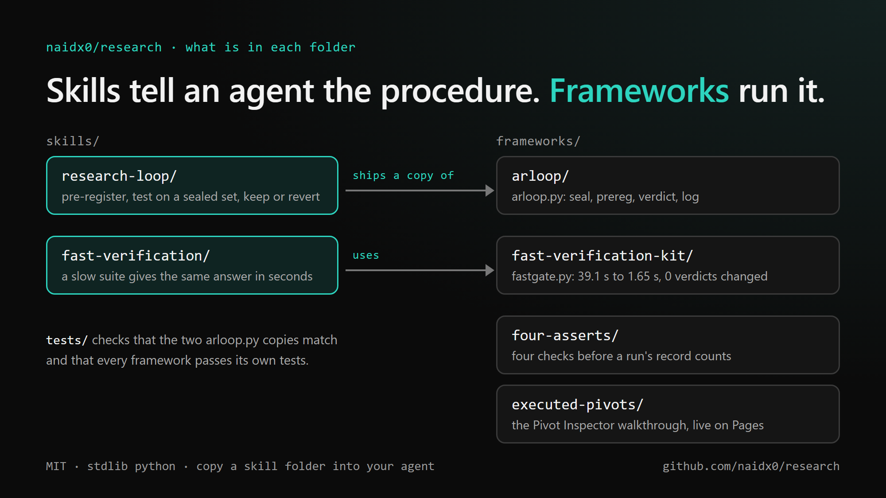
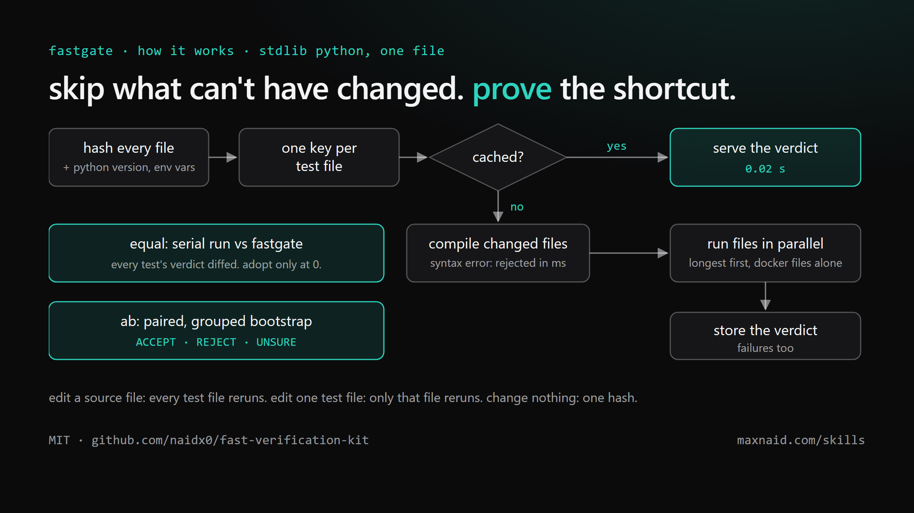

# research

Tools for research that measures itself: every change is tested against a fixed baseline and
kept only if it wins by more than the noise. Plain Python, no dependencies, MIT licensed.

<p align="center">
  
</p>

<p align="center">
  <a href="#skills">Skills</a> ·
  <a href="#frameworks">Frameworks</a> ·
  <a href="#quick-start">Quick start</a> ·
  <a href="https://naidx0.github.io/research/">Pivot Inspector, live</a>
</p>

## Skills

Instructions written for coding agents (Claude Code, Codex and others). Copy a folder into your
agent's skills directory and it knows the procedure.

<table>
  <tr>
    <td width="50%" valign="top"><a href="skills/research-loop/SKILL.md"></a><br>
      <b><a href="skills/research-loop/SKILL.md">research-loop</a></b><br>
      Run an experiment loop: write down the win before the run, test against a sealed baseline,
      keep or revert by a fixed rule, and log every result, losses included. Ships its own copy of <code>arloop.py</code>.</td>
    <td width="50%" valign="top"><a href="skills/fast-verification/SKILL.md"></a><br>
      <b><a href="skills/fast-verification/SKILL.md">fast-verification</a></b><br>
      Make a slow test suite or eval give the same answer in seconds, and turn "is the new
      version better?" into ACCEPT, REJECT or UNSURE.</td>
  </tr>
</table>

## Frameworks

The code those skills run, plus the Executed Pivots walkthrough.

<table>
  <tr>
    <td width="50%" valign="top"><a href="frameworks/arloop/"></a><br>
      <b><a href="frameworks/arloop/">arloop</a></b><br>
      One file. Seals the test rows, records each hypothesis before it runs, compares the new
      score with the baseline and logs KEPT or DISCARDED. <code>python arloop.py selftest</code> prints PASS.</td>
    <td width="50%" valign="top"><a href="frameworks/fast-verification-kit/"></a><br>
      <b><a href="frameworks/fast-verification-kit/">fast-verification-kit</a></b><br>
      <code>fastgate.py</code> speeds up a unittest or pytest suite with a hash cache and parallel
      workers. Measured on one suite: 39.1 s to 1.65 s, with 0 verdicts changed.</td>
  </tr>
  <tr>
    <td width="50%" valign="top"><a href="frameworks/four-asserts/"></a><br>
      <b><a href="frameworks/four-asserts/">four-asserts</a></b><br>
      Four checks before a run's record counts: every case found actually ran, a shared resource
      has a live named holder, a record of what was read outlives the data, and a judge's reason holds up.
      Of 25 agent and eval frameworks read, none checks all four.</td>
    <td width="50%" valign="top"><a href="https://naidx0.github.io/research/"></a><br>
      <b><a href="frameworks/executed-pivots/">executed-pivots</a></b><br>
      The Pivot Inspector walkthrough, <a href="https://naidx0.github.io/research/">live here</a>. It scores an agent's
      terminal step by what the command did, not what it typed: on 546 labelled actions it pays 94 working
      steps where the keystroke reward pays 26. Full project: <a href="https://github.com/naidx0/executed-pivots-public">executed-pivots-public</a>.</td>
  </tr>
</table>

`tests/` checks that the two copies of `arloop.py` match and that every framework passes its own tests.

## Quick start

```bash
python frameworks/arloop/arloop.py selftest
python -m unittest discover -s tests
```

## Not in here

ML Harness and Sequence are products with their own repos:
[ml-harness-app](https://github.com/naidx0/ml-harness-app) and
[sequence-arch-tool](https://github.com/naidx0/sequence-arch-tool).
