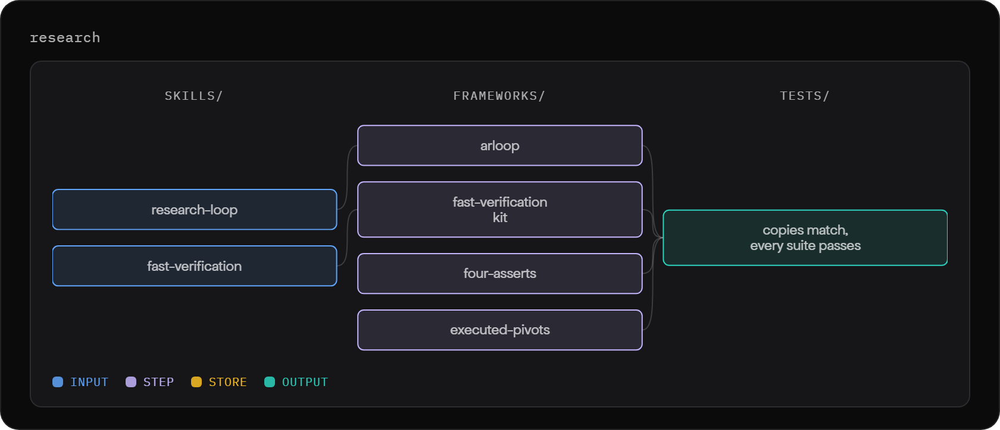
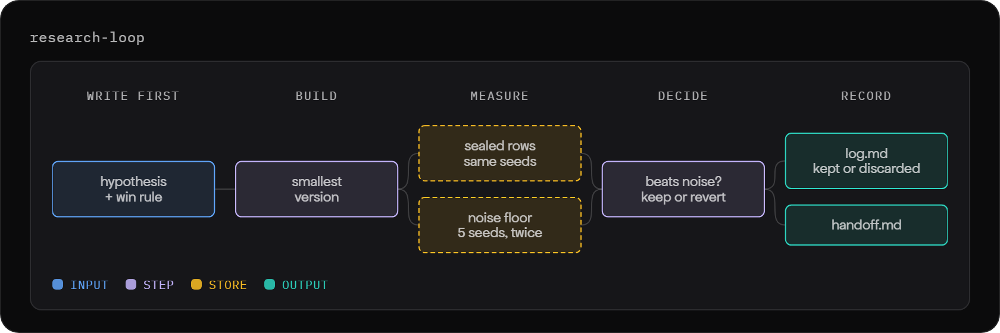
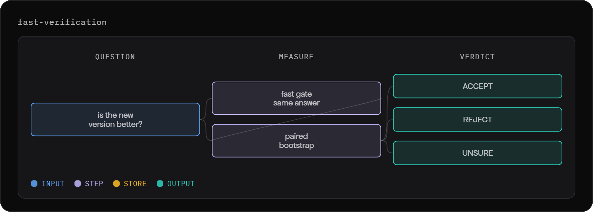
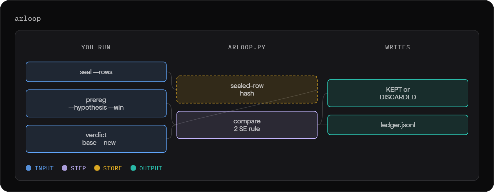
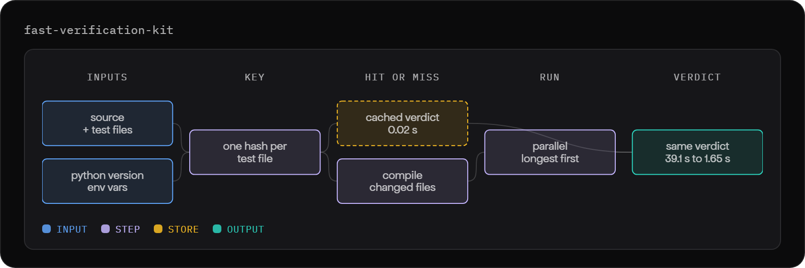
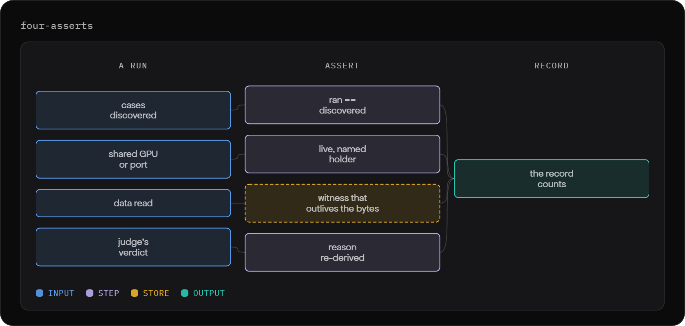
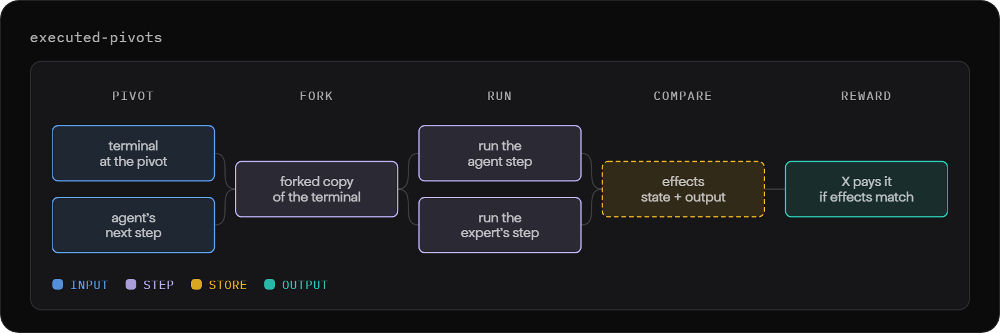

# research

Tools for research that measures itself. Every change is tested against a fixed baseline and kept
only if it wins by more than the noise. Plain Python, no dependencies, MIT licensed.

<p align="center">
  
</p>

`skills/` holds instructions written for coding agents (Claude Code, Codex and others): copy a folder into your
agent's skills directory and it knows the procedure. `frameworks/` holds the code those skills run.
`tests/` checks that the two copies of `arloop.py` match and that every framework passes its own tests.

## skills

<table>
  <tr>
    <td width="45%" valign="top">
      <h3><code>research-loop</code></h3>
      Run an experiment loop. Write down what counts as a win before the run, test against a sealed
      baseline, keep or revert by a fixed rule, and log every result, the losses included.
      <br><br>Ships its own copy of <code>arloop.py</code>.
      <br><br><a href="skills/research-loop/SKILL.md">SKILL.md</a>
    </td>
    <td width="55%"></td>
  </tr>
  <tr>
    <td width="55%"></td>
    <td width="45%" valign="top">
      <h3><code>fast-verification</code></h3>
      Make a slow test suite or eval give the same answer in seconds, then turn "is the new version
      better?" into ACCEPT, REJECT or UNSURE.
      <br><br><a href="skills/fast-verification/SKILL.md">SKILL.md</a>
    </td>
  </tr>
</table>

## frameworks

<table>
  <tr>
    <td width="45%" valign="top">
      <h3><code>arloop</code></h3>
      The keep-or-revert engine, in one file. It seals the test rows, records each hypothesis before
      it runs, compares the new score with the baseline and logs KEPT or DISCARDED.
      <br><br><code>python arloop.py selftest</code> prints PASS.
      <br><br><a href="frameworks/arloop/">Folder</a>
    </td>
    <td width="55%"></td>
  </tr>
  <tr>
    <td width="55%"></td>
    <td width="45%" valign="top">
      <h3><code>fast-verification-kit</code></h3>
      <code>fastgate.py</code> speeds up a unittest or pytest suite with a hash cache and parallel workers.
      <code>fastcheck_template.py</code> does the same for any other scorer.
      <br><br>On one suite, a full run went from 39.1 s to 1.65 s with 0 verdicts changed.
      <br><br><a href="frameworks/fast-verification-kit/">Folder</a>
    </td>
  </tr>
  <tr>
    <td width="45%" valign="top">
      <h3><code>four-asserts</code></h3>
      Four checks before a run's record counts: every case found actually ran, a shared resource has a
      live named holder, a record of what was read outlives the data, and a judge's reason holds up.
      <br><br>Of 25 agent and eval frameworks read, none checks all four.
      <br><br><a href="frameworks/four-asserts/">Folder</a>
    </td>
    <td width="55%"></td>
  </tr>
  <tr>
    <td width="55%"></td>
    <td width="45%" valign="top">
      <h3><code>executed-pivots</code></h3>
      The Pivot Inspector walkthrough. It scores an agent's terminal step by what the command did,
      not by what it typed.
      <br><br>On 546 labelled actions it pays 94 working steps where the keystroke reward pays 26.
      <br><br><a href="https://naidx0.github.io/research/">Open the walkthrough</a> ·
      <a href="https://github.com/naidx0/executed-pivots-public">Full project</a>
    </td>
  </tr>
</table>

## Quick start

```bash
python frameworks/arloop/arloop.py selftest
python -m unittest discover -s tests
```

ML Harness and Sequence are products with their own repos:
[ml-harness-app](https://github.com/naidx0/ml-harness-app) and
[sequence-arch-tool](https://github.com/naidx0/sequence-arch-tool).
