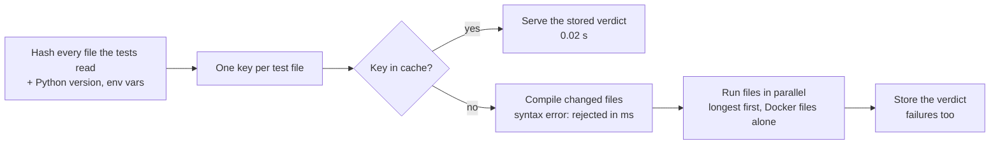
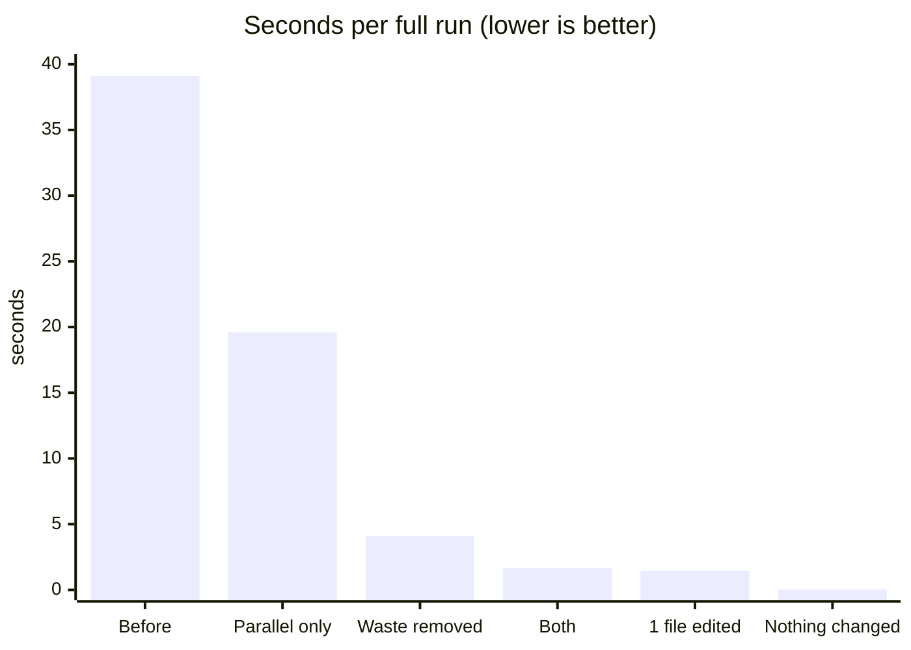
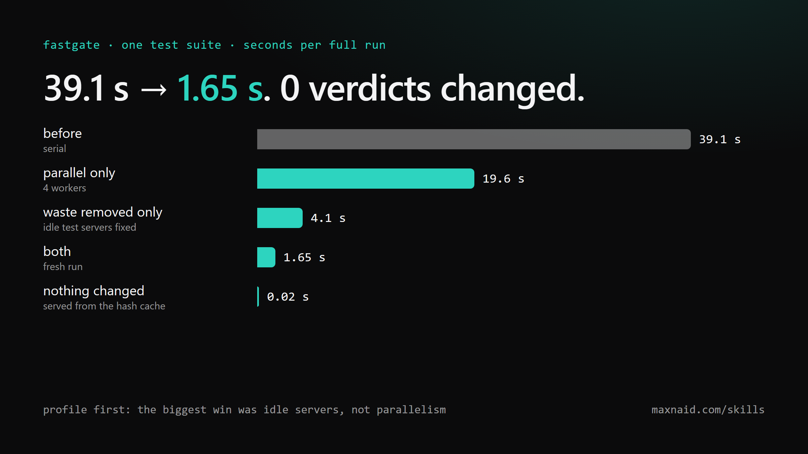
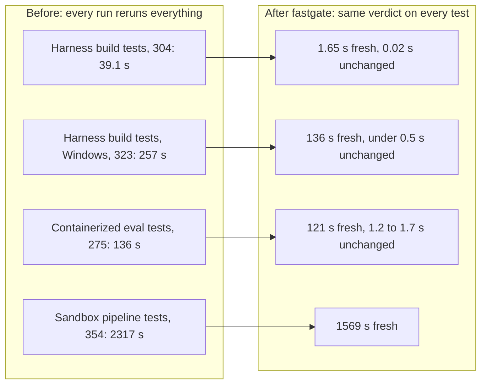
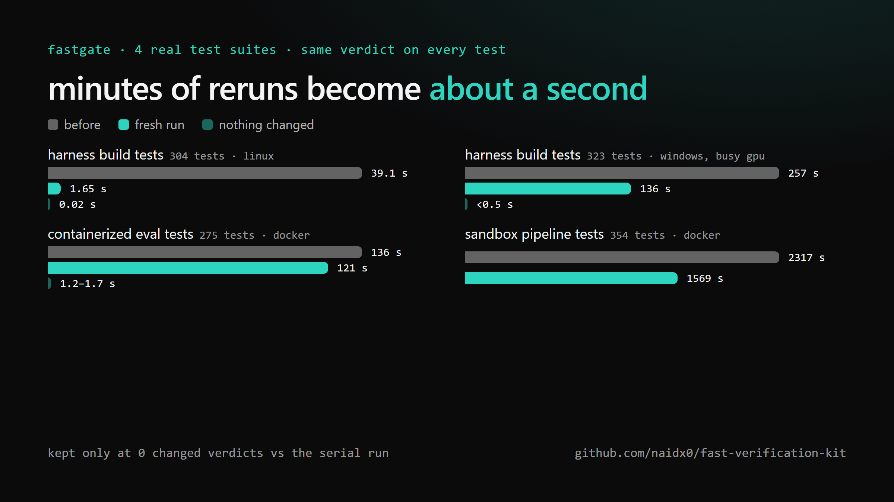
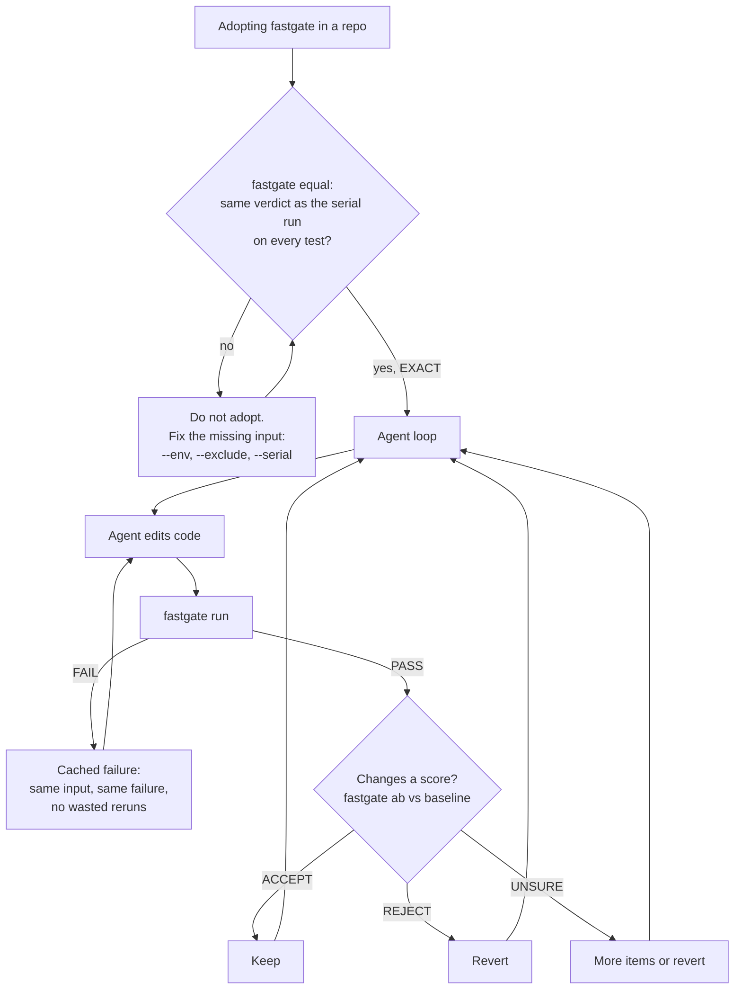

# fast-verification-kit

Make a slow check return the same answer in seconds, and make "is the new version
better?" a mechanical ACCEPT / REJECT / UNSURE verdict. Standard library only.

- `fastgate.py`: drop-in for a unittest or pytest suite. Per-test-file hash cache,
  parallel workers, a compile check first, and an `equal` mode that proves the fast
  gate gives the same verdict as the serial run on every test.
- `fastcheck_template.py`: the same ideas for any other scorer (eval, benchmark,
  backtest). Fill in six small adapter functions.
- `skills/fast-verification/SKILL.md`: the procedure, written for coding agents.

## At a glance

### How it works



Edit a source file and every test file reruns. Edit one test file and only that file
reruns. Change nothing and the gate costs one hash.

### What it saves

One suite, seconds per full run, each change measured on its own:





### Before and after, four suites





### How it keeps agents honest

An agent loop reruns the same check hundreds of times. fastgate makes each rerun cheap,
and two gates stop the loop from trusting a shortcut or a lucky number.



- **equal** is the proof: the fast gate is adopted only at zero changed verdicts.
- **run** is the gate: exit code 0 means PASS, and a syntax error is rejected before
  any test runs.
- **ab** is the keep rule: paired by item, grouped by what is correlated,
  bootstrapped, ACCEPT only when the lower 90% bound is above zero. Nobody argues
  about noise.

## Numbers

| Suite | Tests | Before | After | Verdicts changed |
|---|---|---|---|---|
| Harness build tests, 4-core Linux | 304 | 39.1 s serial | 1.65 s fresh, 0.02 s unchanged | 0 |
| Harness build tests, Windows | 323 | 212 to 270 s | 120 to 148 s fresh | 0 |
| Sandbox pipeline tests, Windows, Docker | 354 | 2317 s | 1569 s fresh | 0 |
| Containerized eval tests, Windows, Docker | 275 | 135.6 s median | 120.9 s fresh, 1.2 to 1.7 s unchanged | 0 |

The biggest win on the first suite was not parallelism. Profiling showed half the time
was test servers idling (a 0.5 s shutdown poll, a 2 ms sleep per streamed chunk).
Removing that took it from 39.1 s to 4.1 s serial; running files in parallel alone
reached 19.6 s. Profile before you speed anything up.

## fastgate

```bash
python fastgate.py equal            # serial run vs fastgate, every test's verdict diffed
python fastgate.py run              # the gate: JSON summary, exit 0 on PASS
python fastgate.py run --fresh      # ignore the cache
python fastgate.py ab BASE.json CAND.json --group-by KEY
```

Options: `--runner pytest`, `--tests DIR`, `--jobs N`, `--env VAR` (an env var that
changes results), `--exclude PATH` (files the tests never read), `--serial GLOB` (files
that share Docker or a fixed port, run one at a time after the pool), `--retry-failed`
(rerun cached failures the machine caused).

How the cache key works: every non-test file in the tree, the Python version, the
named env vars and fastgate itself form one shared hash; each test file adds its own
bytes. Change nothing and the gate costs one tree hash. Edit one test file and only
that file reruns. Edit anything else and every file reruns. Failures are cached too.

The key assumes a test file does not read another `test_*.py` file. Helpers such as
`conftest.py`, fixtures and data are in every key.

## The gate

`ab` and `compare` pair candidate and baseline on the same items, average the deltas
within each group of correlated items, bootstrap over groups, and return ACCEPT only
when the lower bound of the 90% interval is above zero. Different item sets are
refused.

## Tests

```bash
python -m unittest discover -s tests
```

22 tests; one needs pytest and skips without it. Passing on Windows 11 with Python
3.11, 3.13 and 3.14.

## Install as a skill

Copy `skills/fast-verification/` to `~/.claude/skills/` (every project) or a repo's
`.claude/skills/`. Other agent harnesses can read `SKILL.md` as a plain instruction
file. Also at https://maxnaid.com/skills/.

## Licence

MIT. See `LICENSE`.
